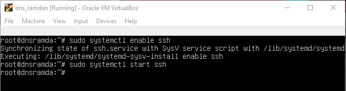

# CARA SSH KE SERVER UBUNTU

SSH (Secure Shell) adalah protokol jaringan yang digunakan untuk mengamankan komunikasi antara dua komputer melalui jaringan yang tidak aman. SSH memberikan enkripsi end-to-end, serta otentikasi dan integritas data, sehingga memastikan bahwa informasi yang dikirimkan antara dua komputer tetap aman dan tidak dapat diakses oleh pihak yang tidak berwenang.

kita memerlukan SSH ( Secure S hell) untuk akses jarak jauh yang aman ke komputer atau server kita sendiri . Ada tiga aspek penting dalam prosedur keamanan yang akan memastikan akses jarak jauh:

Otentikasi terminal jarak jauh memastikan bahwa kontak yang salah (baik klien atau server) tidak dihubungi.
Mengenkripsi transmisi data mencegah orang yang tidak berwenang membaca informasi apa pun.
Memastikan integritas data membuat data yang ditransfer tahan rusak.

## 1 Install Openssh-Server di Ubuntu 20.04

```console
apt install openssh-server
```


## 2 Check SSH Service status

openssh-serverpaket terinstal di Server kita, kita sekarang dapat melihat sshlayanan yang tersedia di bawah /etc/init.d direktori. Sekarang kita dapat memeriksa status

```console
$ /etc/init.d/ssh status

atau

$ sudo systemctl status ssh
```


dapat dilihat pada gambar tersebut ssh dalam keadaan inactive, untuk mengaktifkannya dengan cara :

```console
$ sudo systemctl enable ssh
$ sudo systemctl start ssh
```



maka setelah itu ssh akan aktif seperti gambar di bawah ini


## 3 Membuka Port SSH

Port protokol jaringan (TCP port 22) harus diaktifkan untuk terhubung ke sistem Ubuntu kita melalui SSH dari mana saja. Ini akan memungkinkan kita untuk berhasil membuat koneksi jarak jauh dengan klien SSH seperti PuTTy.

Ubuntu memiliki program konfigurasinya sendiri untuk firewall aslinya, UFW. Aturan yang sesuai harus disiapkan untuk program ini untuk komunikasi SSH sehingga port tetap terbuka untuk data masuk dan keluar:

```console
$ sudo ufw allow ssh
```


## 4 mengkonfigurasi server Ubuntu SSH

Konfigurasi dasar OpenSSH cocok untuk koneksi jarak jauh yang aman ke sistem Ubuntu Anda. kita masih dapat menyesuaikan pengaturan default , seperti memilih port yang berbeda untuk komunikasi, menentukan versi protokol internet, atau menonaktifkan penerusan TCP.

File konfigurasi pusat untuk paket Ubuntu SSH adalah file sshd_config . Buka file ini dengan editor teks (dalam hal ini, nano) pilihan Anda untuk melakukan perubahan:

```console
$ sudo nano /etc/ssh/sshd_config
```


Jika ada yang mau di ubah baik port atau yang lainnya maka jangan untuk me-restart SSH

```console
sudo service ssh restart
```

## 5 Coba SSH menggunakkan PUTTY

Untuk Melakukan SSH kita perlu mengetahui ip address dari server kita maka dari itu kita lakukan

```console
$ ifconfig
```


Dapat dilihat bahwa ip server kita adalah 192.168.1.11 maka kita akan melaukan ssh dari PUTTY kepada ip tersebut lewat port 22


**Berhasil Alhamdulillah**
